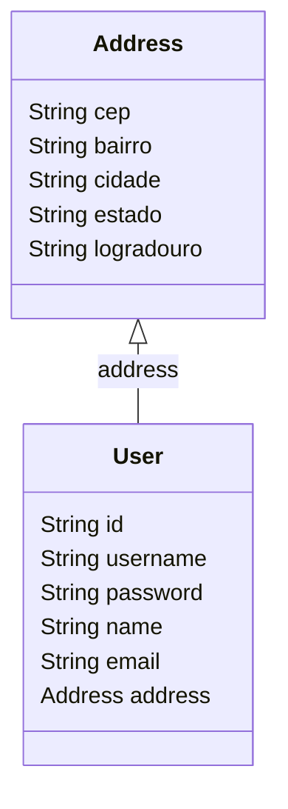
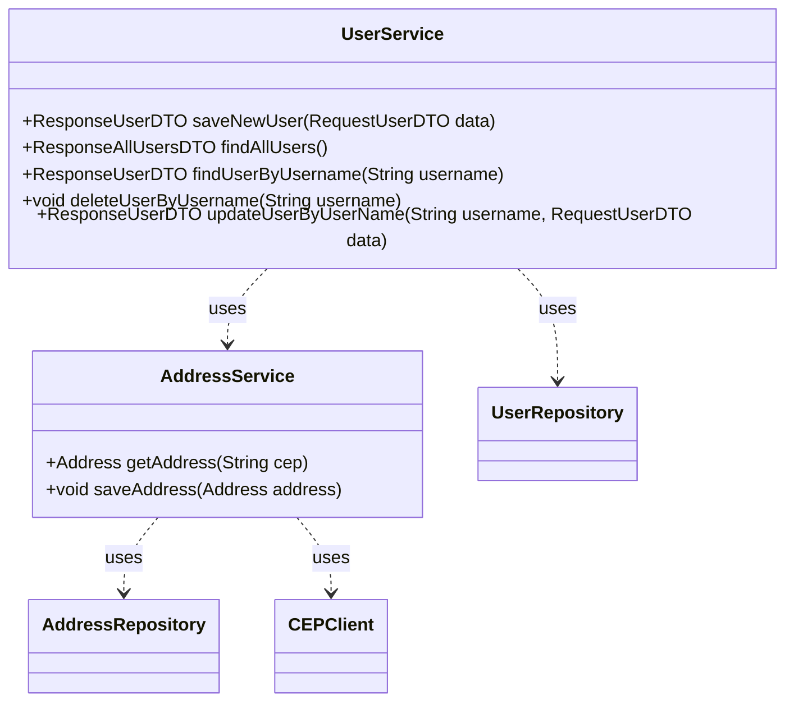
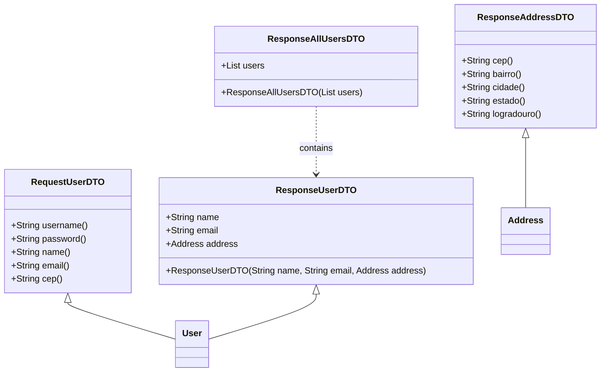
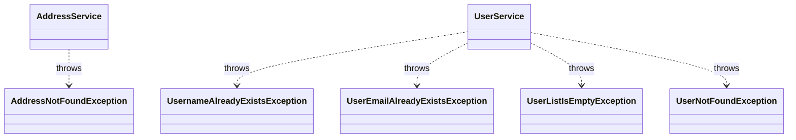

# User API 
Esta API fornece endpoints para operações CRUD em usuários.

## Diagrama de Classes

## Serviços e Repositórios

## DTOs

## APIs Externas
- Postmon - https://postmon.com.br/?ref=public_apis - API pública externa para consulta de CEP (Códigos Postais Brasileiros)

## Endpoints

### 1. Listar todos os usuários
Descrição: Retorna uma lista de todos os usuários.

- URL: /user
- Método HTTP: GET
- Status: 200 OK
- Body: ResponseAllUsersDTO - Um objeto contendo uma lista de todos os usuários.
### 2. Obter usuário por nome de usuário
Descrição: Retorna um usuário específico com base no nome de usuário fornecido.

- URL: /user/{username}
- Método HTTP: GET
- Parâmetros de URL:
- Status: 200 OK
- Body: ResponseUserDTO - Um objeto contendo os detalhes do usuário solicitado.
### 3. Criar um novo usuário
Descrição: Cria um novo usuário com base nos dados fornecidos.

- URL: /user
- Método HTTP: POST
-Status: 201 Created
- Body: ResponseUserDTO - Um objeto contendo os detalhes do usuário criado.

### 4. Excluir usuário por nome de usuário
Descrição: Exclui um usuário com base no nome de usuário fornecido.

- URL: /user/{username}
- Método HTTP: DELETE
- Parâmetros de URL: username - Nome de usuário do usuário que você deseja excluir.
- Status: 200 OK
- Body: HttpStatus.OK
### 5. Atualizar um usuário
Descrição: Atualiza os dados de um usuário com base no nome de usuário fornecido.

- URL: /user/{username}
- Método HTTP: PUT
- Parâmetros de URL:username - Nome de usuário do usuário que você deseja atualizar.
- RequestUserDTO - Um objeto contendo os novos dados do usuário.
- Status: 200 OK
- Body: ResponseUserDTO - Um objeto contendo os detalhes atualizados do usuário.

## Tecnologias Utilizadas

- Java 17: Linguagem de programação
- Spring Boot 3: Aplicação do Spring Framework
- Postgres 16: Banco de dados relacional
- Spring JPA: Abstração de persistência de dados para Java, que simplifica a interação com bancos de dados.
- Swagger OpenAPI: Ferramenta para documentar e testar a API.
- FlyWay: Ferramenta para migração de banco de dados, gerenciando mudanças no esquema.
- Lombok: Biblioteca para simplificar a escrita de código Java, eliminando código boilerplate.
- FeignClient: Cliente HTTP declarativo para chamar outras APIs.
